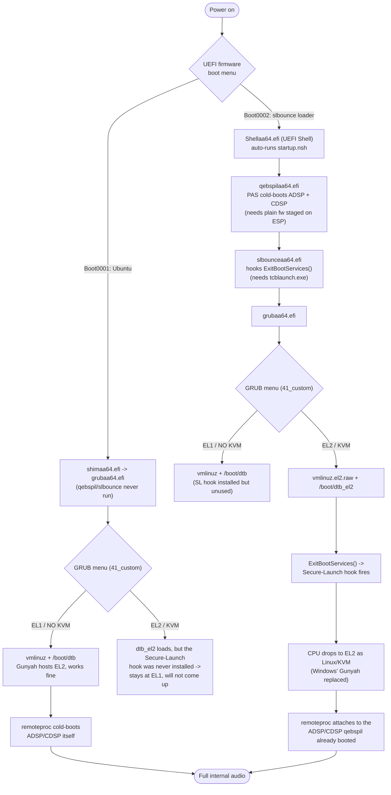

# t14s_x1e_linux

Boot-chain files and kernel install/build tooling for running Linux (including
self-hosted EL2, replacing Gunyah) on a Lenovo ThinkPad T14s Gen 6
(Snapdragon X1E80100 / "hamoa"), a Windows-on-ARM laptop.

The actual kernel source lives in a separate tree
([`linux-jq`](https://git.kernel.org/), branch `build/7.2.5-jg-0` or later);
this repo only holds the pieces around it: the pre-Linux boot chain that runs
before GRUB, and the scripts used to build/install/remove kernel packages.

## Boot chain



Picking "EL2 / KVM" from GRUB only works if you got there via the
**"slbounce loader"** firmware boot entry — reaching the same menu entry via
the plain **"Ubuntu"** entry loads the EL2 device tree without ever having
installed the Secure-Launch hook, so the CPU never actually leaves EL1 and
the boot does not come up. This tripped up earlier iterations of this setup — a since-removed helper
script (`el2-grub-entry.sh`) had this exact warning in its own comments —
and is the single most common way to break the EL2 boot path.

These WoA laptops ship a UEFI firmware that expects to launch Windows via
Microsoft's Secure-Launch (DRTM) mechanism. `startup.nsh` is a UEFI Shell
script that chain-loads three things, in order, before handing off to GRUB:

```
FS13:
load \EFI\slbounce\qebspilaa64.efi
load \EFI\slbounce\slbounceaa64.efi
\EFI\ubuntu\grubaa64.efi
```

1. **[qebspil](https://github.com/stephan-gh/qebspil)** (`qebspilaa64.efi`) —
   cold-boots Qualcomm co-processors (ADSP/CDSP) via PAS authenticate+reset,
   *before* `ExitBootServices()`. This matters because on this firmware,
   Linux running bare-metal at EL2 (no hypervisor) cannot itself perform the
   reset-release step for these DSPs — only the platform's normal boot chain
   (Windows' hypervisor, or qebspil standing in for it) can. Without this,
   Linux can only *attach* to whatever limited "lite" firmware the ROM
   bootloader already started, which is missing full functionality (no
   internal audio, in particular — see below).
2. **[slbounce](https://github.com/TravMurav/slbounce)**
   (`slbounceaa64.efi`) — performs the actual Secure-Launch handoff that
   drops the CPU into EL2 for whatever OS boots next, replacing Windows'
   hypervisor (Gunyah) with Linux running as its own EL2 host. Requires a
   Microsoft-signed `tcblaunch.exe` (see below).
3. **GRUB** (`grubaa64.efi`, from the distro) boots the actual kernel —
   either the normal EL1/Gunyah-hosted `vmlinuz`+`/boot/dtb`, or, for
   self-hosted EL2, `vmlinuz.el2.raw`+`/boot/dtb_el2`.

`sltest.efi` and `slbounce-launcher.efi` are companion utilities from the
slbounce project (a standalone EL2-switch test, and an alternate launcher);
not used by `startup.nsh` directly but kept alongside for reference.
`Shellaa64.efi` is just the standard UEFI Shell binary these are invoked
from.

### tcblaunch.exe — deliberately not included

`slbounce` needs a Microsoft-signed `tcblaunch.exe` (the same binary Windows
itself uses for Secure-Launch) to present to the firmware. This is
Microsoft's own signed binary, not something this project can redistribute —
upstream `slbounce`'s own documentation says to pull your own copy from a
licensed Windows install instead of downloading one from anywhere else:

```
cp /path/to/windows/partition/Windows/System32/tcblaunch.exe boot/EFI/slbounce/
```

### Licenses of vendored binaries

The `.efi` binaries under `boot/EFI/slbounce/` are pre-built artifacts from
other open-source projects, not this repo's own code:

| File | Upstream | License |
|---|---|---|
| `qebspilaa64.efi` | [stephan-gh/qebspil](https://github.com/stephan-gh/qebspil) | GPL-2.0-only |
| `slbounce.efi`, `slbounceaa64.efi`, `slbounce-launcher.efi`, `sltest.efi` | [TravMurav/slbounce](https://github.com/TravMurav/slbounce) | BSD-3-Clause (deps: arm64-sysreg-lib MIT, gnu-efi/dtc BSD-2-Clause) |
| `Shellaa64.efi` | [TianoCore EDK2](https://github.com/tianocore/edk2) UEFI Shell | BSD-2-Clause-Patent |

To rebuild any of them from source instead of trusting these binaries:

```
# qebspil
git clone --recursive https://github.com/stephan-gh/qebspil
cd qebspil && make CROSS_COMPILE=aarch64-linux-gnu-
# output: out/qebspilaa64.efi

# slbounce
git clone --recursive https://github.com/TravMurav/slbounce
cd slbounce && make
# optional: make dtbs
```

### qebspil firmware staging — the actual bug this repo exists to remember

qebspil needs the ADSP/CDSP firmware images as **plain, uncompressed** files
at `/firmware/qcom/<soc>/<oem>/<model>/...` on the **same ESP partition**
`qebspilaa64.efi` itself lives on. It runs before the Linux rootfs is
mounted, so it cannot read an LVM/ext4/LUKS root, and it cannot decompress
the `.zst` files Debian/Ubuntu kernel packaging puts under `/lib/firmware`.

If qebspil can't find/open a firmware file, it silently continues without
that DSP — the *only* place you'll see it fail is its own on-screen output
during the UEFI Shell stage, before GRUB even loads (not suppressed by
`quiet splash`, which only affects the Linux kernel later):

```
qebspil: Found remoteproc: ...
Firmware 1: base 0x..., .../21N1/adsp_dtbs.elf
Failed to enumerate remoteproc: ...
```

Fix: decompress and stage the plain firmware files yourself, e.g. for the
T14s (Lenovo 21N1, X1E80100):

```
sudo mkdir -p /boot/efi/firmware/qcom/x1e80100/LENOVO/21N1
for f in qcadsp8380.mbn qccdsp8380.mbn adsp_dtbs.elf cdsp_dtbs.elf; do
  sudo zstd -d -f -o "/boot/efi/firmware/qcom/x1e80100/LENOVO/21N1/$f" \
    "/lib/firmware/qcom/x1e80100/LENOVO/21N1/${f}.zst"
done
```

(Find the exact firmware-name list for your board with:
`find /sys/firmware/devicetree -name firmware-name -exec cat {} + | xargs -0n1`)

`scripts/install_t14s.sh` re-runs this staging step automatically after
every kernel install, so it isn't lost as one-off manual tribal knowledge.

Without this, `qcom_q6v5_pas.c` (`qcom,broken-reset`, attach-only mode under
EL2) attaches to the ADSP/CDSP, but no GPR/APR service and no
`adsp_apps`-driven audio ever comes up — `remoteproc` shows `attached`, and
`/sys/kernel/debug/remoteproc/remoteprocN/resource_table` says "No resource
table found", but nothing about that state on its own tells you it's the ESP
firmware that's missing rather than a kernel bug. Compare
`sudo dmesg | grep -iE 'glink|rpmsg|adsp|remoteproc|apr|gpr'` between a
working boot and a broken one — presence of
`qcom,apr ...: Adding APR/GPR dev` and `gpr:service@1:dais` lines is the
signal that qebspil actually did its job.

## Firmware boot menu entry

`startup.nsh` only runs if something actually launches the UEFI Shell in the
first place. On this machine that's a dedicated NVRAM boot entry, separate
from the normal `Ubuntu` (shim → grub) entry, pointing straight at
`Shellaa64.efi`:

```
$ efibootmgr -v
BootOrder: 0001,0002,0000,...
Boot0001* Ubuntu          HD(1,GPT,...)/\EFI\ubuntu\shimaa64.efi
Boot0002* slbounce loader  HD(1,GPT,...)/\EFI\slbounce\Shellaa64.efi
```

Selecting "slbounce loader" from the firmware boot menu (e.g. F12 at power-on)
launches the Shell, which auto-runs `\startup.nsh` at the ESP root — that's
what starts the qebspil → slbounce → GRUB chain described below. Without this
entry, there's no way to reach that chain short of manually driving the UEFI
Shell by hand.

To recreate it on another install (adjust `--disk`/`--part` to your ESP):

```
sudo efibootmgr --create --disk /dev/nvme0n1 --part 1 \
  --label "slbounce loader" --loader '\EFI\slbounce\Shellaa64.efi'
```

## GRUB entries

`boot/grub.d/41_custom` provides the two menu entries GRUB actually boots
between:

- **`Ubuntu, vmlinuz (EL1 / NO KVM)`** — normal boot, `/vmlinuz` + `/boot/dtb`,
  Gunyah hosts EL2 as usual (no `/dev/kvm`).
- **`Ubuntu, vmlinuz.el2.raw (EL2 / KVM)`** — self-hosted EL2, `vmlinuz.el2.raw`
  + `/boot/dtb_el2`, Linux itself runs as the EL2 hypervisor (`/dev/kvm`
  present) after `slbounce` does the Secure-Launch handoff. Reaching this
  path is the entire reason the rest of this repo's boot chain exists.

Both entries are kept 1:1 with what `10_linux` generates for the installed
kernel (see the file's own header comment for how to re-diff after
`update-grub`). The `search --fs-uuid` line hardcodes this machine's root
filesystem UUID (`21f58603-...`) — replace it with your own
(`findmnt -no UUID /`) if adapting this elsewhere.

## Scripts

`scripts/install_t14s.sh` and `scripts/uninstall_t14s.sh` install and remove
the kernel packages built from the `linux-jq` source tree, and keep
`/boot/dtb`, `/boot/dtb_el2`, `/boot/vmlinuz.el2.raw`, and the qebspil ESP
firmware staging in sync with whichever kernel version is currently
installed. See each script's `--help` for usage.

`ubuntu-x1e-settings` (a stock Canonical package, not vendored here — install
it with `apt install ubuntu-x1e-settings`) provides
`/etc/default/grub.d/ubuntu-x1e-settings.cfg`, which sets
`GRUB_DISABLE_OS_PROBER=false`, the `clk_ignore_unused pd_ignore_unused
cma=128M efi=noruntime` cmdline flags baked into both GRUB entries above, and
a `GRUB_BADRAM` range for this platform.

## Credits

None of the actual hard engineering here is this repo's own — it just wires
together and documents other people's work for this specific machine:

- **[Stephan Gerhold](https://github.com/stephan-gh)** — wrote
  [`qebspil`](https://github.com/stephan-gh/qebspil), the UEFI co-processor
  loader this entire audio-under-EL2 fix depends on, plus the upstream
  `qcom_q6v5_pas`/`qcom,broken-reset` work and companion kernel patches for
  attaching to firmware qebspil starts early (see his
  `git.kernel.org/pub/scm/linux/kernel/git/sre/linux-misc.git`,
  branch `thinkpad-t14s-x1e`).
- **[TravMurav](https://github.com/TravMurav)** — wrote
  [`slbounce`](https://github.com/TravMurav/slbounce) and documented the
  Secure-Launch process for Qualcomm devices
  ([Qcom-Secure-Launch](https://github.com/TravMurav/Qcom-Secure-Launch)),
  which is what makes self-hosted EL2 possible on this hardware at all.
- **[Jens Glathe](https://github.com/jglathe) (oldschoolsolutions)** — the
  `x1-el2*.dtso` overlay work this whole boot chain sits on top of, tested
  across multiple X1E laptops including this T14s.
- **[TianoCore EDK2](https://github.com/tianocore/edk2)** project — the UEFI
  Shell binary (`Shellaa64.efi`) `startup.nsh` runs under.
- **Tobias Heider / Canonical** — `ubuntu-x1e-settings`, referenced above.
- The broader **[Ubuntu Concept: Snapdragon X Elite](https://discourse.ubuntu.com/t/ubuntu-concept-snapdragon-x-elite/48800)**
  community thread and everyone in it — the shared, ongoing effort to bring
  up Linux on this generation of Snapdragon X Elite laptops that all of the
  above (and this repo) builds on.
